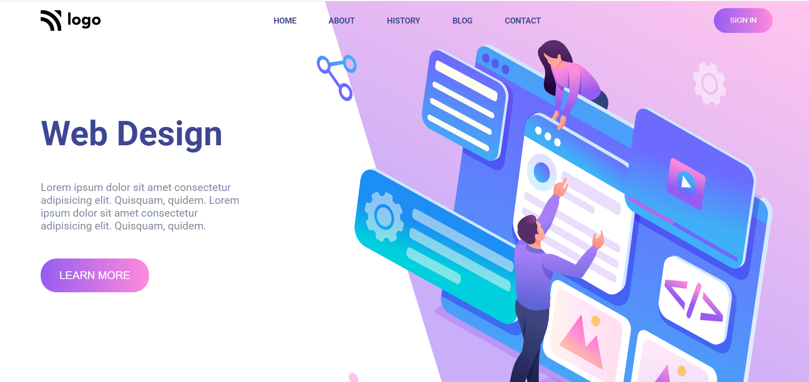

# **web design landing page | Project_08**

Hi, I'm **Hemanth Kumar R**

This is a static one page portfolio Template made using HTML & CSS

### **What I have learned ?**

- sizing an svg as `background-image`.
- Implementing `linear-gradient()`.

### **Time spent to finish it.**

It took me 5 hours to make this project.Please find link of the project below.

**[Live Project's netlify link](https://chipper-naiad-37d00c.netlify.app/ "Project link")**

